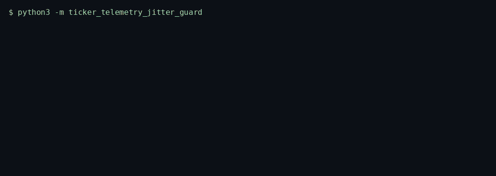
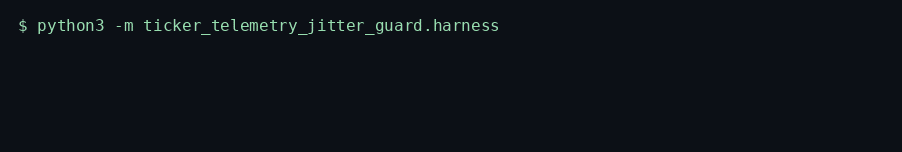
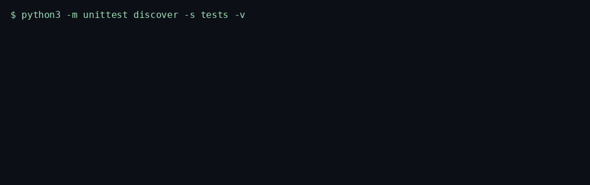

# Ticker Telemetry Jitter Guard

> Clamps venue clock skew on consolidated NBBO ticks, rejects inverted or non-finite quotes, and scores a sub-450 µs burst with a two-sample Allan deviation.

<p>
  <a href="https://github.com/TechieGoku2623/ticker-telemetry-jitter-guard/actions/workflows/ci.yml"></a>
  
  
</p>

| | |
| --- | --- |
| **Website** | https://github.com/TechieGoku2623/ticker-telemetry-jitter-guard |
| **Topics** | `python` `asyncio` `finance` `market-data` `low-latency` `telemetry` `trading` |

## Walkthrough

### How it works


One real batch, in order: what went in, which gate fired, what came out.

Three recordings from this repository. Each one is the command in the frame, not a drawing.

### Engine

`python3 -m ticker_telemetry_jitter_guard`



A clock step past five seconds raises `EngineKernelException`. A small backward step is clamped. Eight gaps under 450 µs set `burst`.

### Benchmark

`python3 -m ticker_telemetry_jitter_guard.harness`



A 5000-iteration four-tick batch. `random.Random(613)`. The frame ends on the status line and `echo $?`.

### Tests

`python3 -m unittest discover -s tests -v`



Wire round-trip, the happy path, and both edge cases below.

## Pipeline

```
tick
  |
  v
pack --> queue --> unpack --> ingest
  |-- skew > 5 s ---------> EngineKernelException
  |-- NaN or ask < bid ---> rejected
  |-- gap < 450 µs x 8 ---> burst
  v
{accepted, rejected, burst, adev_ns, ring_depth}
```

## Quick start

```bash
python3 -m venv venv
source venv/bin/activate
pip install -e ".[dev]"
python -m ticker_telemetry_jitter_guard
python -m ticker_telemetry_jitter_guard.harness
python -m unittest discover -s tests -v
```

Python 3.12. The runtime is the standard library. `black` and `flake8` are the `dev` extra.

## Use it

```python
import asyncio

from ticker_telemetry_jitter_guard import TickerTelemetryJitterGuard


async def demo() -> None:
    guard = TickerTelemetryJitterGuard()
    report = await guard.run(
        [
            {
                "venue": "XNYS",
                "symbol": "AAPL",
                "bid": 189.25,
                "ask": 189.5,
                "size": 100,
                "epoch_ns": 1_700_000_000_000_000_000,
                "sequence": 1,
            }
        ]
    )
    accepted = int(report["accepted"])
    depth = report["ring_depth"]
    print(accepted, depth)


asyncio.run(demo())
```

## Bounds

| | |
| --- | ---: |
| Iterations | 5000 |
| Average | 694.572 µs |
| P99 | 815.923 µs |
| tracemalloc peak | 206435 bytes |

Figures are from the harness on the machine that published them. A later host moves the microseconds. The pass/fail result does not.

## What it refuses

- Non-monotonic timestamps beyond 5 s raise `EngineKernelException`. Smaller skew is clamped and counted.
- NaN prices and inverted markets (`ask < bid`) are rejected and never enter the gap ring.

Aligned with SEC Rule 613 clock-sync discipline for consolidated audit timestamps. This process does not submit orders and is not a CAT reporter.

## Tree

```
src/ticker_telemetry_jitter_guard/
  engine.py       kernel
  wire.py         struct frames
  harness.py      benchmark
  __main__.py     demo entry
tests/test_engine.py
Dockerfile        non-root, uid 10001
```
